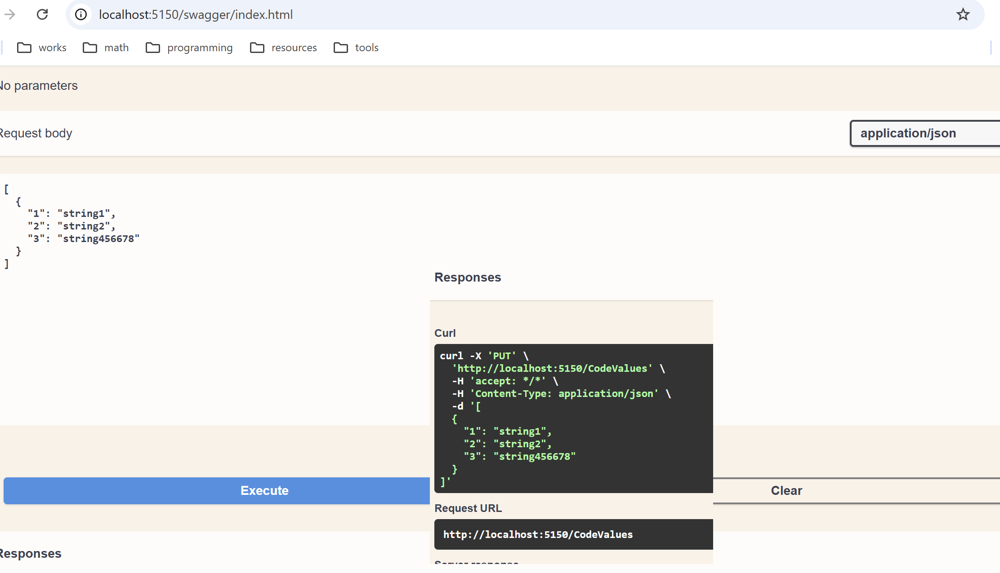
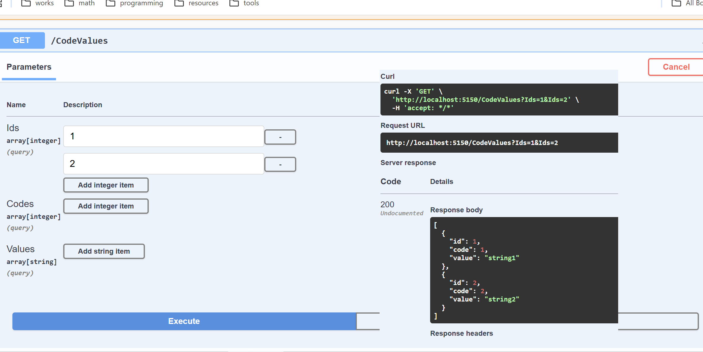
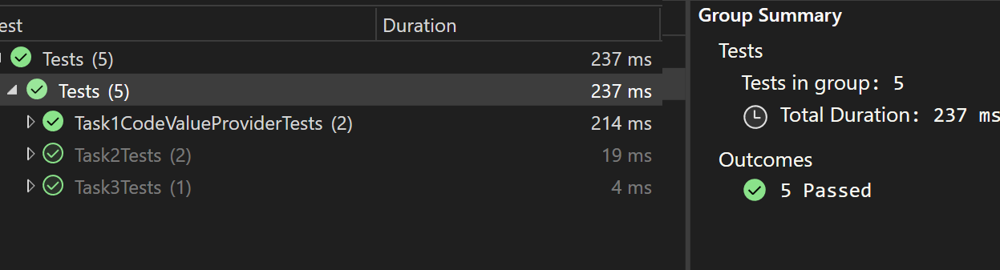

# CodeValueREST

(rest, .NET 8, Web API, VSA, Mediator, Dapper, PostgreSQL, Docker, Docker-Compose, NUnit, FluentAssert)

## Запустить решение первой задачи можно: 'F5' в Visual Studio (http)

## Демонстрация работоспособности:

